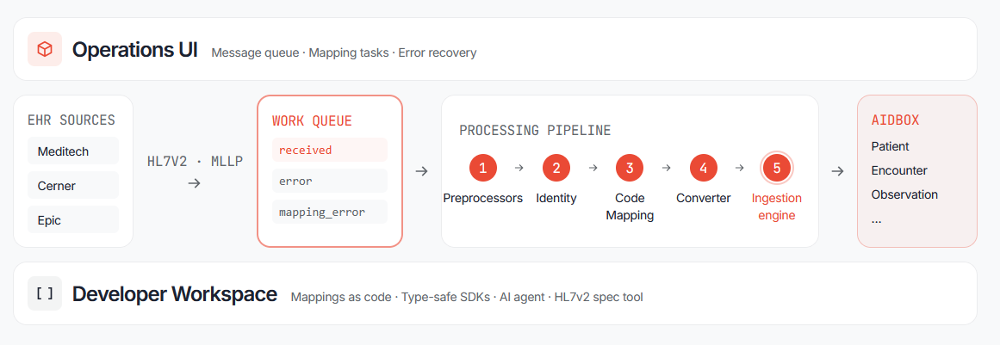

# Aidbox HL7 Integration

Demo for bidirectional HL7v2 ↔ FHIR conversion, built on [Aidbox](https://www.health-samurai.io/aidbox).

- **HL7v2 → FHIR:** ADT (admissions), ORU (lab results), ORM (orders), VXU (immunization), MDM (documents) → Patient, Encounter, DiagnosticReport, Observation, etc.
- **FHIR → HL7v2:** Invoice/Account + related resources → BAR^P01/P05/P06 (billing).

## Motivation

Healthcare integration is stuck between two standards. Most clinical systems — labs, ADT feeds, billing — still speak HL7v2, a pipe-delimited format from the 1980s. New apps, analytics, and patient-facing tools want FHIR (modern JSON resources). Teams end up writing custom translation code for every interface, with no shared queue, no retry, no error visibility.

Traditional HL7v2 integration projects are expensive, slow, and brittle. Vendor interface engines cost six figures per year, every new sender variant needs hand-tuned mapping by a specialist, and the underlying tooling — interface engines, mapping DSLs, ops dashboards — is decades old. A single ORU feed from a new lab can take months and a dedicated integration analyst.

**AI-first by design.** This project is built to be driven by AI agents, not just edited by humans. Every layer — converters, fixtures, error queues, code-mapping tasks, FHIR/HL7v2 spec lookups — is exposed through skills (`hl7v2-info`, `fhir-info`, `message-lookup`, `check-errors`, `hl7v2-to-fhir-pipeline`) so an agent can add a new message type, debug a stuck message, or resolve unmapped codes end-to-end. CLAUDE.md captures the rules; `.claude/skills/` captures the workflows. The aim: collapse months of integration work into a guided agent loop.

This shows how we at Health Samurai solve that:

- **Durable message queue.** Every inbound message is persisted as a custom `IncomingHL7v2Message` resource with status (`received` → `processed` / error). Retries, deferrals, and reprocessing are first-class — not lost in memory.
- **Local code → LOINC mapping.** Labs send their own codes (`K_SERUM`, `GLU_FAST`). The system tracks unmapped codes per-sender (`MSH-3`/`MSH-4`), surfaces them as Tasks, and saves resolutions to a per-sender ConceptMap. Mapping grows incrementally instead of being a blocking up-front project.
- **Visible failures.** Parsing errors, conversion errors, code-mapping gaps, and send failures each have their own status. UI pages show the queue; operators see exactly where a message stopped and why.
- **Custom resources via Aidbox FHIR Schema.** `IncomingHL7v2Message` and `OutgoingBarMessage` are project-specific resource types — no separate database, same auth, same search, same audit as core FHIR data.

The goal isn't to be a production HL7v2 engine. It's a working reference: how to model HL7v2 traffic on top of FHIR, where to put the seams (parse / convert / submit / send), and what the operator UI looks like when things go wrong.

## Architecture Overview



Three horizontal bands wrap a left-to-right data flow.

**Data flow (middle row):**

1. **EHR sources** — Meditech, Cerner, Epic and similar systems push HL7v2 over MLLP.
2. **Work queue** — every message lands as `IncomingHL7v2Message` with a status (`received`, `error`, `mapping_error`, ...). Queue is a FHIR resource in Aidbox, not a separate broker.
3. **Processing pipeline** — five stages, each isolated and independently testable:
   1. **Preprocessors** — normalize wrappers, fix encoding, split batches.
   2. **Identity** — resolve Patient/Encounter from `PID-3` / `PV1-19`.
   3. **Code mapping** — translate local lab codes to LOINC via per-sender ConceptMaps; unmapped codes raise Tasks.
   4. **Converter** — message-type-specific HL7v2 → FHIR (ADT, ORU, ORM, VXU, MDM).
   5. **Ingestion engine** — atomic transaction submit to Aidbox.
4. **Aidbox** — FHIR resources land here: Patient, Encounter, Observation, DiagnosticReport, ...

**Operations UI (top band):** message queue browser, mapping-task workspace, error recovery (defer, retry, reprocess). Operators don't read logs — they work the queue.

**Developer Workspace (bottom band):** mappings as code (TypeScript, not a DSL), type-safe SDKs generated from FHIR + HL7v2 specs, AI-agent skills, HL7v2 spec lookup tool. Everything an engineer or agent needs to add a new sender or message type without leaving the repo.

## Quick Start

**Prerequisites:** [Bun](https://bun.sh) v1.2+, [Docker](https://docker.com).

```sh
bun install
docker compose up -d              # Aidbox + PostgreSQL
# Open http://localhost:8080, log in at aidbox.app to activate license (first run only)
bun run migrate                   # Install custom resources (IncomingHL7v2Message, OutgoingBarMessage)
bun run dev                       # Start web server + in-process polling workers
```

Access points:
- **Web UI:** http://localhost:3000
- **Aidbox Console:** http://localhost:8080 — login as `admin` with `BOX_ADMIN_PASSWORD` from `docker-compose.yaml`
- **MLLP Server:** localhost:2575

Optional: `bun scripts/load-test-data.ts` loads 5 patients with encounters, conditions, procedures, coverages.

## Concepts

**HL7v2** — legacy healthcare messaging standard. Pipe-delimited segments (`MSH`, `PID`, `OBX`, ...). Field notation: `PID-3` = segment PID, field 3.

**FHIR** — modern JSON-based healthcare data standard. Resources like Patient, Encounter, Observation.

**MLLP** — TCP framing for HL7v2. Start byte `0x0B`, end bytes `0x1C 0x0D`.

**LOINC** — standard coding system for lab tests. Labs often send local codes instead — this system maps them to LOINC.

**ConceptMap** — FHIR resource storing code translations. One ConceptMap per sender (sending app + facility from MSH-3/MSH-4). Built incrementally as users resolve mapping tasks.

**Aidbox** — FHIR server. Central data store for all FHIR resources and custom message queues (`IncomingHL7v2Message`, `OutgoingBarMessage`).

## How It Works

```
External Systems ──HL7v2/MLLP──▶ This System ──FHIR──▶ Aidbox
                                      ▲
                                      └──FHIR──── Aidbox ──HL7v2/MLLP──▶ Billing
```

### Inbound (HL7v2 → FHIR)

1. MLLP server receives message, stores as `IncomingHL7v2Message` with status `received`, sends ACK.
2. Polling processor converts to FHIR resources (ADT → Patient + Encounter; ORU → DiagnosticReport + Observations; etc.).
3. Status progresses: `received` → `processed` (or error status — see below).
4. Unmapped lab codes create tasks in `/unmapped-codes`. Resolving a task saves to the sender's ConceptMap and requeues the message.

### Outbound (FHIR → HL7v2 BAR)

1. Create an `Account` (groups patient + encounters + procedures + coverages).
2. Polling builder reads pending accounts, assembles BAR segments (PID, PV1, DG1, PR1, IN1, GT1, ...), stores as `OutgoingBarMessage` with status `pending`.
3. Polling sender transmits. In demo mode sends back to own MLLP port for visibility.

### UI Pages

| URL | Purpose |
|-----|---------|
| `/` | Dashboard — demo conductor, stats, worker health |
| `/accounts` | Account list, "Build BAR" trigger |
| `/outgoing-messages` | Generated BAR queue, "Send" trigger |
| `/incoming-messages` | Inbound list, status filters, message detail |
| `/unmapped-codes` | Resolve local codes to LOINC |
| `/terminology` | View/edit ConceptMap entries by sender |
| `/simulate-sender` | Send test HL7v2 over MLLP from the browser |

### Workers

`bun run dev` boots three in-process pollers via `src/workers.ts`:
- Inbound HL7v2 processor
- Account BAR builder
- BAR message sender

Env flags: `DISABLE_POLLING=1` disables all. `POLL_INTERVAL_MS` overrides tick (default 1000ms).

## Configuration

Most deployments only need a `.env` file. Defaults work for local demo.

| Variable | Default | Purpose |
|----------|---------|---------|
| `AIDBOX_URL` | `http://localhost:8080` | FHIR server URL |
| `AIDBOX_CLIENT_ID` | `root` | API client ID |
| `AIDBOX_CLIENT_SECRET` | see `docker-compose.yaml` | API client secret |
| `MLLP_PORT` | `2575` | MLLP listener port |
| `FHIR_APP` / `FHIR_FAC` | — | Sending app/facility (MSH-3/4) in outbound BAR |
| `BILLING_APP` / `BILLING_FAC` | — | Receiving app/facility (MSH-5/6) in outbound BAR |
| `DISABLE_POLLING` | unset | Set to `1` to disable all workers |
| `POLL_INTERVAL_MS` | `1000` | Worker poll interval |
| `DEMO_MODE` | unset | Set to `on` to show the Dashboard's "Run scripted demo" card and enable `/demo/run-scenario` |

**Production checklist:**
- Change `AIDBOX_CLIENT_SECRET` + `BOX_ADMIN_PASSWORD` in `docker-compose.yaml`.
- Set `FHIR_APP/FAC` and `BILLING_APP/FAC` to identify your site.
- Replace the demo sender in `src/bar/sender-service.ts` with real MLLP transmission to your billing system.

## Code Mapping (LOINC)

ORU messages often carry local lab codes. Two ways to map them:

**Interactive** — Messages with unmapped codes land in `code_mapping_error`. Open `/unmapped-codes`, search LOINC, resolve. The mapping saves to the sender's ConceptMap (id format `hl7v2-{sendingApp}-{sendingFacility}-to-loinc`) and the message requeues.

**Bulk import** — PUT a ConceptMap directly to Aidbox for known code sets. See `src/aidbox.ts` for the authenticated client. ConceptMap shape:

```json
{
  "resourceType": "ConceptMap",
  "id": "hl7v2-labsystem-mainfacility-to-loinc",
  "status": "active",
  "group": [{
    "source": "http://labsystem.local/codes",
    "target": "http://loinc.org",
    "element": [{
      "code": "K_SERUM",
      "target": [{ "code": "2823-3", "equivalence": "equivalent" }]
    }]
  }]
}
```

## Troubleshooting

### Status reference

`IncomingHL7v2Message.status`:

| Status | Meaning |
|--------|---------|
| `received` | Unprocessed |
| `processed` | Converted + submitted to Aidbox |
| `warning` | Converted + submitted with non-fatal gap (e.g., missing PV1 → no Encounter) |
| `parsing_error` | Malformed HL7v2 — sender must fix |
| `conversion_error` | Parsed but missing/invalid data for FHIR conversion |
| `code_mapping_error` | Unmapped code, Task created; auto-requeued on resolution |
| `sending_error` | Aidbox submission failed; auto-retried 3 times |
| `deferred` | Manually set via `POST /defer/:id`; requeue via `POST /mark-for-retry/:id` |

`OutgoingBarMessage.status`: `pending`, `sent`, `error`.

`Account.processing-status` extension: `pending`, `completed`, `error`, `failed` (after 3 retries).

### Common issues

**Aidbox won't start.** Check `docker compose logs aidbox`. Causes: license not activated (open http://localhost:8080), port 8080 conflict (`lsof -i :8080`), Postgres race (`docker compose down && docker compose up -d`).

**Messages stuck in `received`.** Workers not running. Confirm `bun run dev` is up (not `DISABLE_POLLING=1`). Tail `bun run logs`.

**MLLP connection refused.** `bun run mllp` (separate process from `bun run dev`). Confirm port: `lsof -i :2575`.

**Patient/Encounter not found (ORU).** Send an ADT^A01 first, or create Patient manually. `PID-3` must match `Patient.identifier[].value`; `PV1-19` must match `Encounter.identifier[].value`.

**BAR generation fails.** Account needs `subject` (Patient ref) + at least one Encounter ref. Condition/Procedure go via `account-diagnosis` / `account-procedure` extensions.

### Logs + reset

```sh
bun run logs                      # Tail server
docker compose logs -f aidbox     # Aidbox
bun run truncate-aidbox           # Delete all project data (preserves terminology/profiles)
docker compose down -v && docker compose up -d && bun run migrate  # Full wipe
```

## Supported Message Types

- **Inbound:** ADT^A01/A03/A08, ORU^R01, ORM^O01, VXU^V04, MDM^T02
- **Outbound:** BAR^P01/P05/P06

## Development

```sh
bun run typecheck                 # TypeScript check
bun test:local                    # Unit + smoke tests (~10s, everyday loop)
bun test:all                      # Unit + full integration (CI)
bun run regenerate-fhir           # Regenerate src/fhir/ from FHIR R4 spec
bun run regenerate-hl7v2          # Regenerate src/hl7v2/generated/
```

See `CLAUDE.md` for project rules, gotchas, and the mandatory HL7v2/FHIR spec-lookup workflow before making changes.

## AI Agent Skills

Skills live in `.claude/skills/`. Exposed to other agents via `.agents/skills` (symlink). Key skills:

- `hl7v2-info`, `fhir-info` — spec lookups
- `message-lookup` — check if a message is already supported
- `check-errors` — diagnose processing failures
- `hl7v2-to-fhir-pipeline` — guided new-converter workflow (`/plan` + `/work`)
- `aidbox-request` — authenticated curl helper for ad-hoc Aidbox API calls

## Reference

`specs/v2-to-fhir/` — V2-to-FHIR IG mapping CSVs (message, segment, codesystem).
