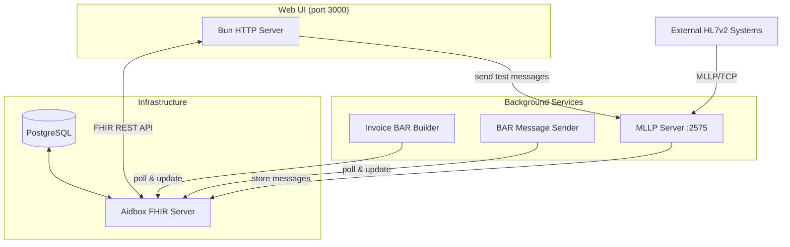
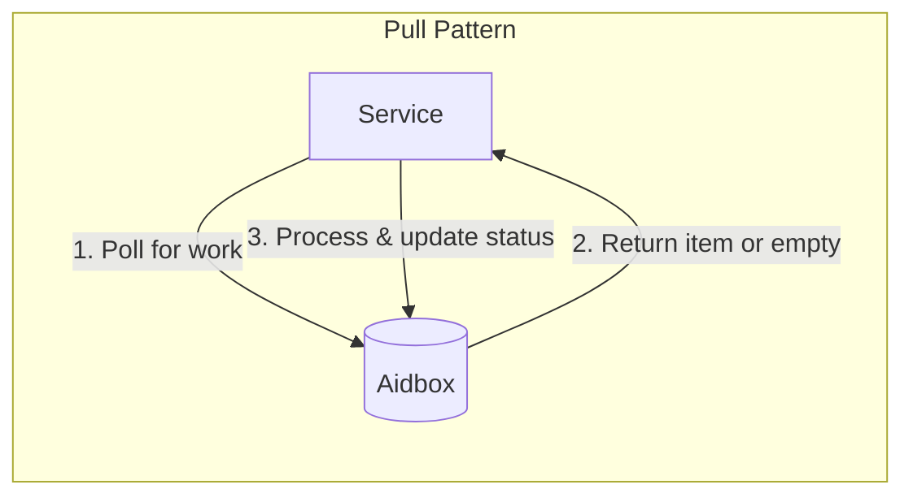
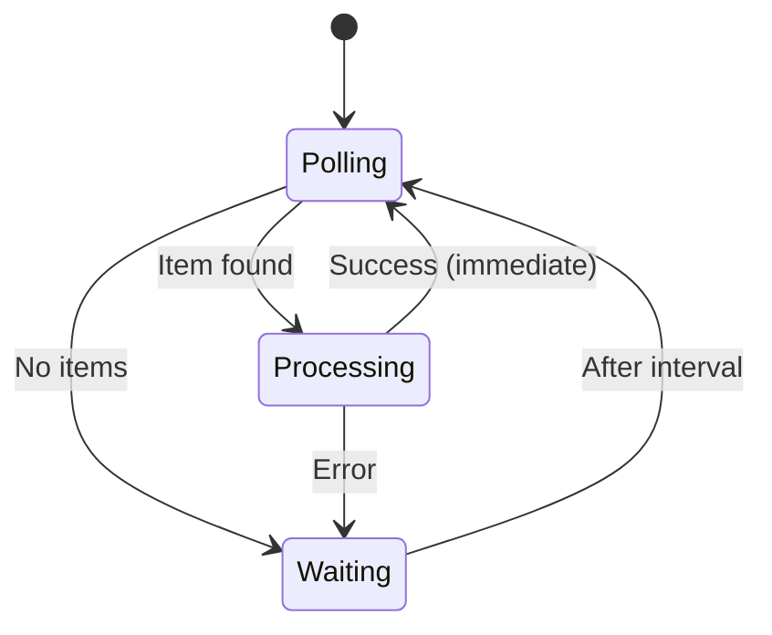
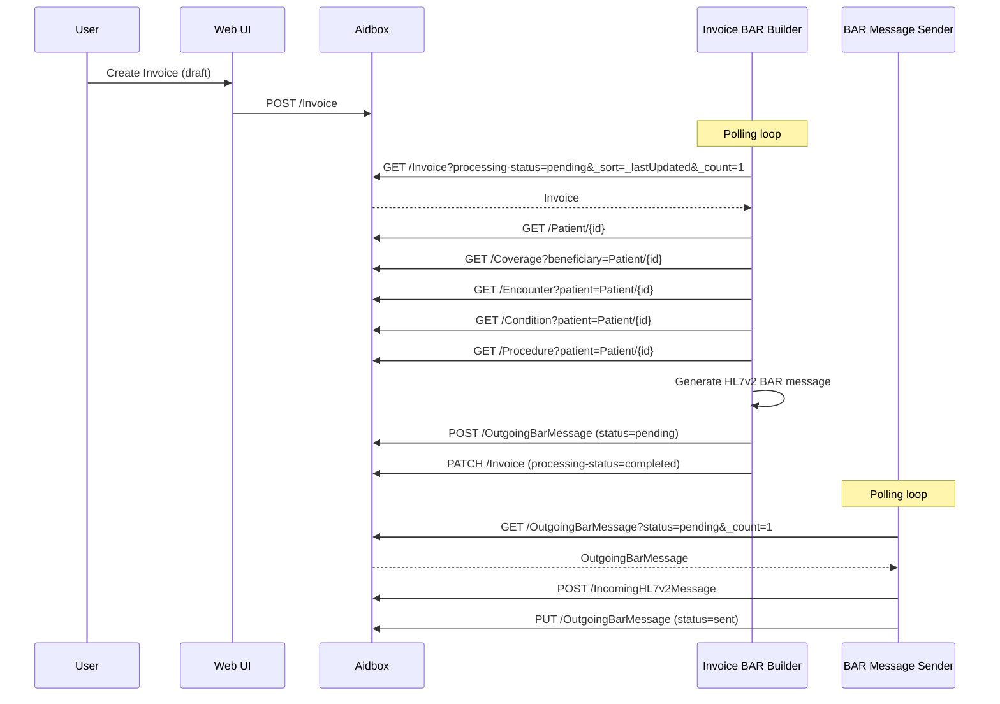
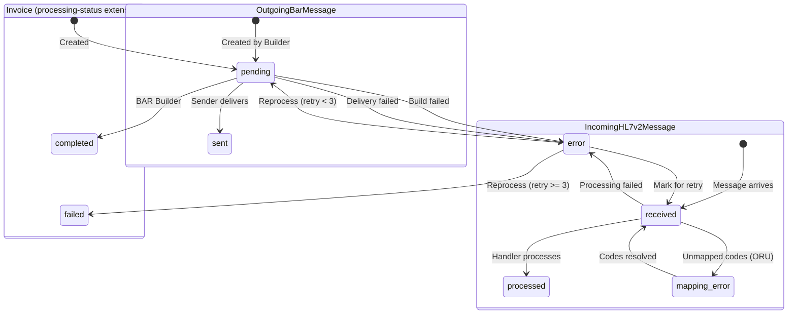
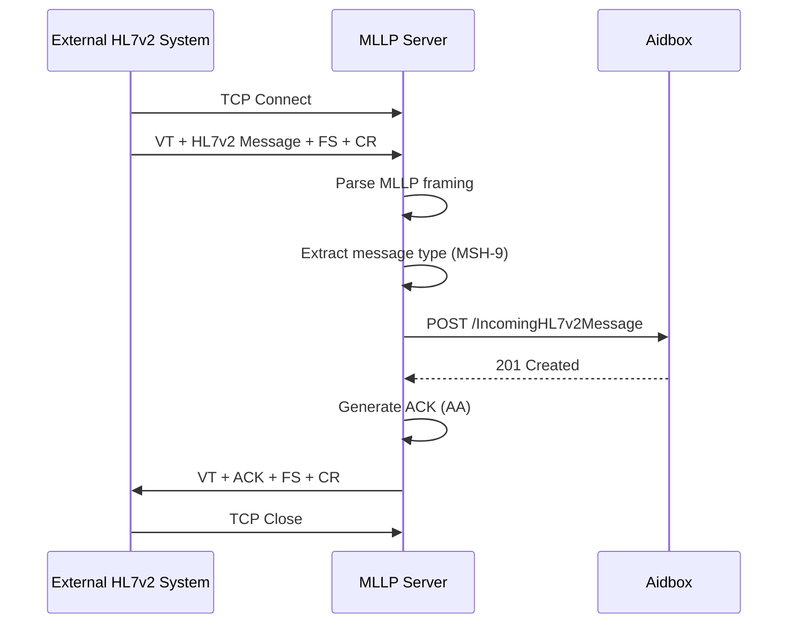
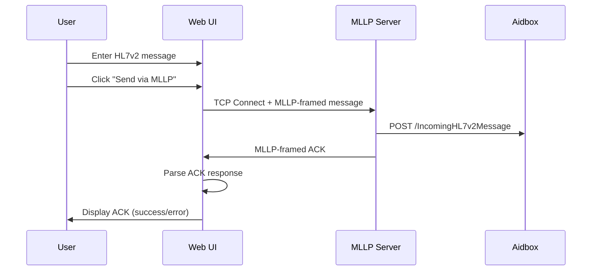

# Architecture

## Overview

This system implements a **pull-based architecture** for HL7v2 BAR message generation and delivery using Aidbox as the central FHIR server. Services poll Aidbox for work rather than receiving push notifications, providing resilience and simplicity.



## Components

### Aidbox FHIR Server

[Aidbox](https://www.health-samurai.io/aidbox) is a FHIR R4 compliant server that serves as the central data store and API layer. See `docker-compose.yaml` for configuration details.

**Standard FHIR Resources:** Patient, Invoice, Coverage, Encounter, Condition, Procedure, Organization, RelatedPerson. See [User Guide > Concepts](../user-guide/concepts.md#fhir-resources) for descriptions.

**Custom Resources (defined via StructureDefinition):**
- `OutgoingBarMessage` - Queued BAR messages (status: pending → sent)
- `IncomingHL7v2Message` - Received HL7v2 messages (status: received → processed)

### Init Bundle (`init-bundle.json`)

Aidbox executes the init bundle at startup before the HTTP server starts. Used for database initialization that must be idempotent.

**Current contents:**
- Custom StructureDefinitions for IncomingHL7v2Message and OutgoingBarMessage
- Invoice processing status extensions (status, retry count, error reason)
- SearchParameters for custom resources and invoice extensions
- LOINC ValueSet used by the terminology workflow
- PostgreSQL partial index for pending invoices

```sql
CREATE INDEX IF NOT EXISTS invoice_pending_ts_idx
ON invoice (ts ASC)
WHERE resource @> '{"extension": [{"url": "http://example.org/invoice-processing-status", "value": {"code": "pending"}}]}'
```

This index optimizes the Invoice BAR Builder polling query by indexing only pending invoices.

### Aidbox Client (`src/aidbox.ts`)

Thin HTTP client for Aidbox FHIR API with Basic authentication.

```typescript
// Environment variables (with defaults)
AIDBOX_URL=http://localhost:8080
AIDBOX_CLIENT_ID=root
AIDBOX_CLIENT_SECRET=Vbro4upIT1

// Exported functions
aidboxFetch<T>(path, options)  // Raw FHIR API call
getResources<T>(type, params)  // Search with Bundle unwrapping
putResource<T>(type, id, res)  // Create/update resource
```

### Web UI (`src/index.ts`)

Bun HTTP server serving server-rendered HTML pages with Tailwind CSS.

**Routes:** The Web UI provides pages for managing invoices, messages, and code mappings. See [User Guide > Overview](../user-guide/overview.md#web-ui-pages) for the complete list.

### Invoice BAR Builder Service (`src/bar/invoice-builder-service.ts`)

Background service that transforms FHIR resources into HL7v2 BAR messages.

**Process:**
1. Poll for oldest `Invoice` with `processing-status=pending` (custom extension)
2. Fetch related resources (Patient, Coverage, Encounter, Condition, Procedure)
3. Generate HL7v2 BAR message using segment builders
4. Create `OutgoingBarMessage` with `status=pending`
5. Update `Invoice` to `status=issued`

### BAR Message Sender Service (`src/bar/sender-service.ts`)

Background service that delivers queued BAR messages.

**Process:**
1. Poll for oldest `OutgoingBarMessage` with `status=pending`
2. POST as `IncomingHL7v2Message` (simulates external delivery)
3. Update `OutgoingBarMessage` to `status=sent`

### MLLP Server (`src/mllp/mllp-server.ts`)

TCP server implementing the Minimal Lower Layer Protocol (MLLP) for receiving HL7v2 messages from external systems.

- Default port: 2575 (configurable via `MLLP_PORT`)
- Stores messages as `IncomingHL7v2Message` resources
- Sends HL7v2 ACK responses

See [MLLP Server](mllp-server.md) for protocol details, framing format, and implementation walkthrough.

## Pull Architecture

Both background services use a **pull-based polling pattern** rather than push notifications (webhooks, FHIR subscriptions, or message queues).



**Benefits:**
- **Resilience** - Services can restart without losing work; unprocessed items remain in queue
- **Simplicity** - No webhook configuration, message queues, or event infrastructure needed
- **Scalability** - Multiple service instances can poll concurrently (first-to-claim wins)
- **Observability** - Work queue is visible as FHIR resources with status

**Polling Logic:**
- Poll interval: 60 seconds (configurable)
- On success: Poll immediately for next item (drain queue quickly)
- On empty: Wait for poll interval
- On error: Wait for poll interval, then retry



## Data Flow

### Invoice to BAR Message



### Resource Status Transitions



### Invoice Retry Mechanism

Failed invoices can be retried up to 3 times before being marked as permanently failed. See [BAR Generation > Error Handling](bar-generation.md#error-handling) for the retry logic and extension details.

## HL7v2 Message Generation

The system generates HL7v2 BAR (Billing/Accounts Receivable) messages from FHIR resources:

| FHIR Resource         | HL7v2 Segment | Purpose                  |
|-----------------------|---------------|--------------------------|
| -                     | MSH           | Message header           |
| -                     | EVN           | Event type (P01/P05/P06) |
| Patient               | PID           | Patient identification   |
| Encounter             | PV1           | Patient visit            |
| Coverage              | IN1           | Insurance                |
| Condition             | DG1           | Diagnosis                |
| Procedure             | PR1           | Procedures               |
| RelatedPerson/Patient | GT1           | Guarantor                |

**Trigger Events:**
- `P01` - Add patient account
- `P05` - Update account
- `P06` - End account

## MLLP Message Flow

### External System to Aidbox



### Web UI Test Client



## Where to Go Next

This document covers system-level architecture. For implementation details on specific features:

| Feature | Document | What You'll Learn |
|---------|----------|-------------------|
| **Outgoing BAR messages** | [BAR Generation](bar-generation.md) | FHIR→HL7v2 mapping, segment builders, trigger events |
| **Incoming lab results** | [ORU Processing](oru-processing.md) | HL7v2→FHIR conversion, draft resources, segment grouping |
| **LOINC code mapping** | [Code Mapping](code-mapping.md) | Resolution cascade, ConceptMap structure, Task workflow |
| **HL7v2 transport** | [MLLP Server](mllp-server.md) | TCP handling, framing, ACK generation |
| **Message building** | [HL7v2 Module](hl7v2-module.md) | Builders, field naming, code generation |

For extending the system:

| Task | Guide |
|------|-------|
| Add new FHIR→HL7v2 fields | [How-To: Extending Outgoing Fields](how-to/extending-outgoing-fields.md) |
| Add new HL7v2→FHIR fields | [How-To: Extending Incoming Fields](how-to/extending-incoming-fields.md) |
| Extract modules for reuse | [How-To: Extracting Modules](how-to/extracting-modules.md) |
