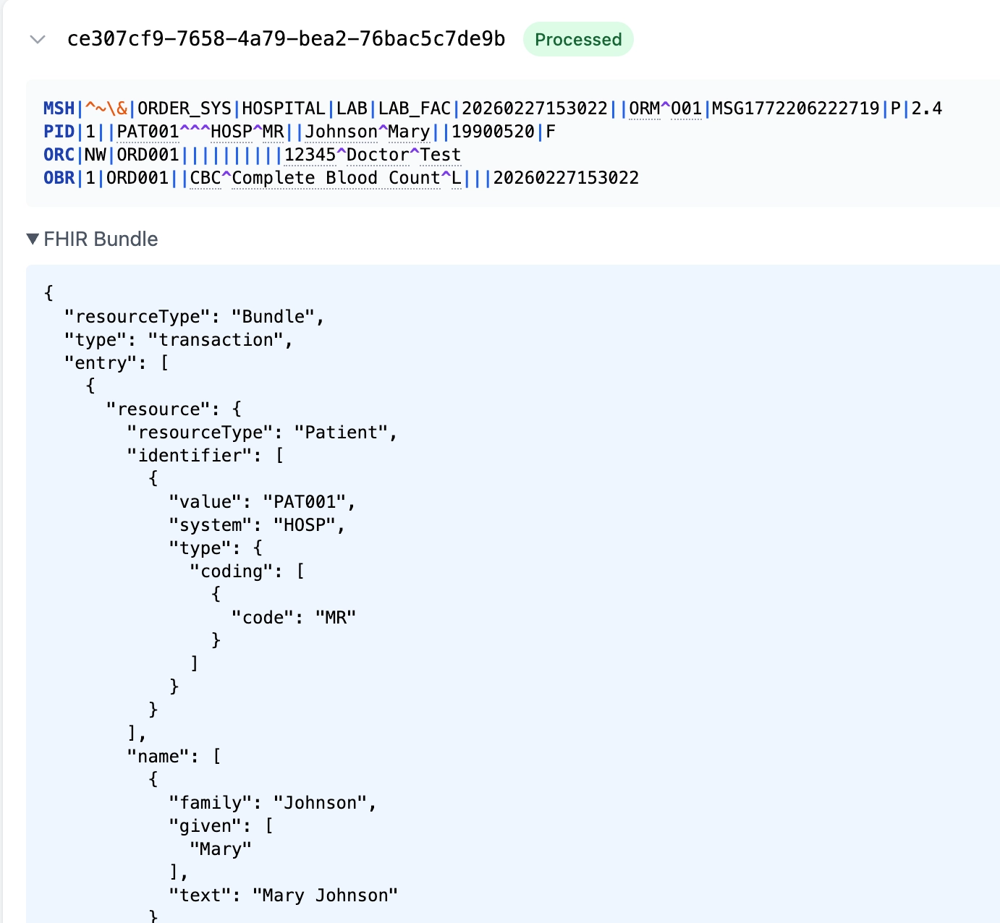
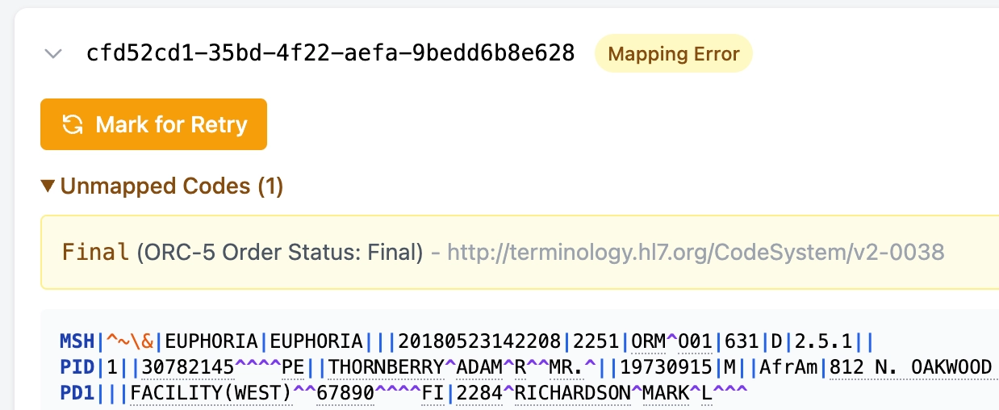

# Converter Pipeline Skill

`/hl7v2-to-fhir-pipeline` skill allows engineers to ask an AI agent to write a new converter or modify conversion behavior and mappings, while keeping the agent in a guarded workflow that ensures the implementation works for compliant and real-world HL7v2 messages.

You can type in free text what you need or even drop a single thing you need to implement. 

As an example, I wanted to implement a conversion for ORM^O01 message:

```
/hl7v2-to-fhir-pipeline ORM
```

Model's instant response:

```
ORM (Order Message): ORM^O01 is a general order message. It's a legitimate HL7v2→FHIR conversion target (maps to ServiceRequest, Task, etc.). However, ORM is a broad message type — it can carry lab orders, radiology orders, pharmacy orders, etc. The scope matters significantly for design.
   
Tradeoff: Starting ORM without narrowing scope could lead to a huge converter. We should clarify scope during the requirements phase. 

The ticket directory is set up at ai/tickets/converter-skill-tickets/orm-converter/.

Do you have real ORM example messages you can place in ai/tickets/converter-skill-tickets/orm-converter/examples/? Or should I generate synthetic examples from the HL7v2 spec?
```

I added the example files to the specified directory.

```
Good, 6 example files. Let me read them and then de-identify before committing.
 ...
Now let me commit Step 1.
...
```

After some time, it needed my input to choose how to handle edge-cases:

```
The Design Agent needs your input on 4 open questions before finalizing the design:  
                                                            
OQ-1: ORC-5 Non-Standard Values ("Final", "Pending")
  Recommendation: (A) Create orc-status mapping type (like existing obr-status), enabling ConceptMap-based per-sender resolution. Follows established project pattern with minimal added complexity.

OQ-2: ORM OBX LOINC Resolution    
  Recommendation: Skip LOINC resolution for ORM OBX. These are order-context observations (ask-at-order-entry), not lab results. Direct CodeableConcept mapping avoids unnecessary mapping_error blocks.

OQ-3: Encounter ID from PID-18
  Recommendation: Skip PID-18 fallback. Simply don't create Encounter when PV1-19 is absent. Avoids conflating account/visit concepts. Encounter is secondary context for ORM.

OQ-4: IN1 -> Coverage
  Question: Include Coverage processing now (reusing existing convertIN1ToCoverage() from ADT), or defer?
```

I decided to trust its intelligence:

```
> Let the design agent decide on his own. It has my approval.
```

Once it finished the design, it made a comprehensive implementation plan in the ticket file containing 14 tasks. The plan allows the agent to manage the context better, and it helps to recover from interruptions easier.

It worked for 2 hours, and then my session limit hit. When I logged into another account and triggered the skill again - it correctly continued the work:

```
Let me read the ticket file and check the current state of work.                 ...                                                               
Tasks 1-6 are completed. The next task is Task 7: ORM order grouping and ID generation. Let me read the implementation prompt and start the next sub-agent.
```

The second account’s session limits died after Task 9. So I switched to Codex. It was more cautious, but it picked up from where Claude finished correctly:

```
You want the hl7v2-to-fhir-pipeline run on ticket.md. Tradeoff: rerunning from Step 1 would overwrite prior analysis and waste time, so I’ll first detect the last completed step and resume from there, then continue through implementation and review.

...

I found that Steps 1–6 are already present (Goal, Requirements, Implementation Design, Implementation Plan). Next I’m checking task status in the plan and current code/test state to determine whether to execute Step 7 implementation or Step 8 review/fixes.

...

I’ve confirmed ORM converter code is already implemented through Task 9. Next I’m validating what’s missing for Task 10+ (tests, fixtures, docs), then I’ll add only the gaps.
```

Codex didn’t spawn any sub-agents, but still completed the implementation correctly.

I checked on the ui - ORM conversion works:



For unknown status codes it uses our existing Mapping Task feature:



You can see this PR to check the work it's done fully autonomously: 
