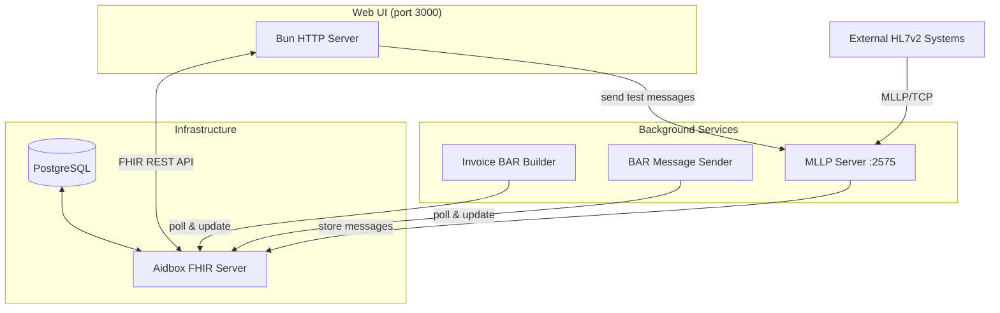
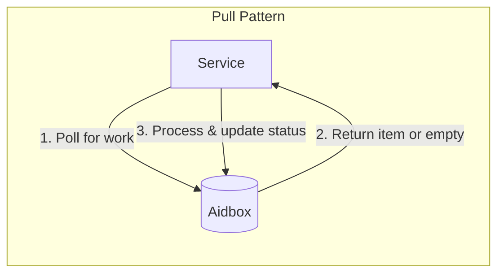
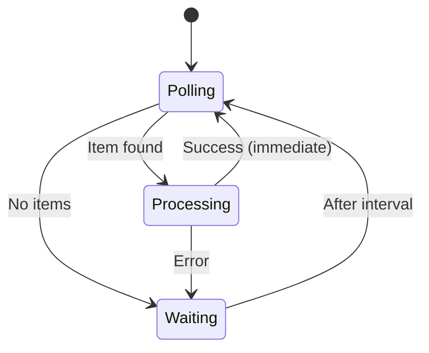
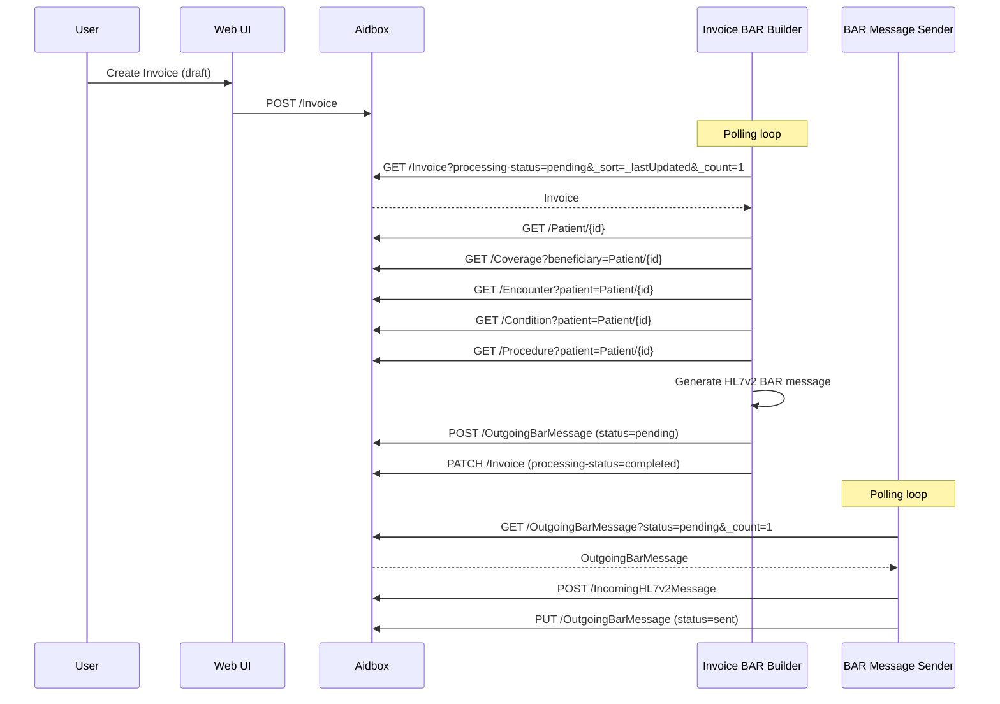
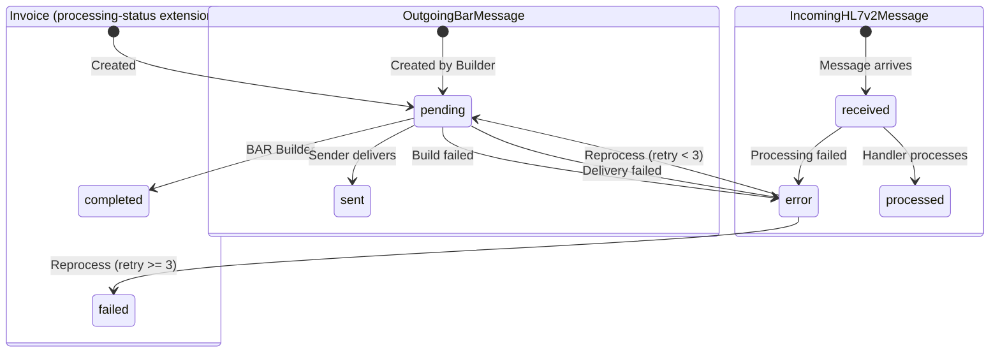
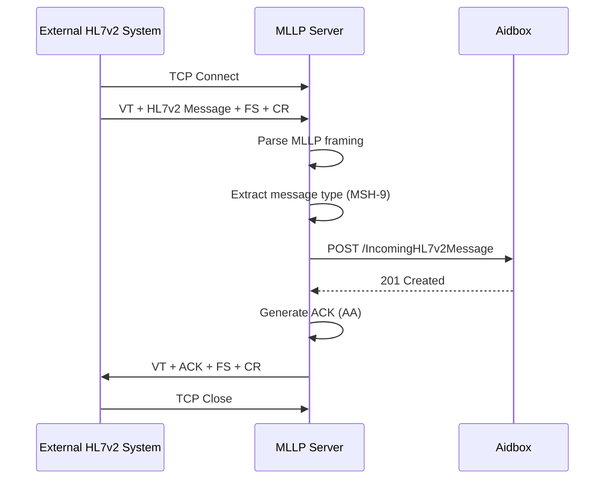
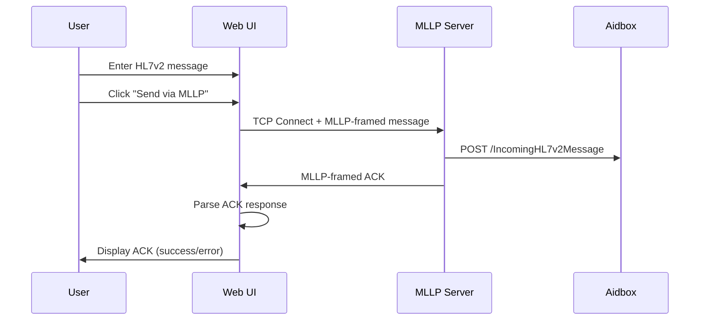

# Architecture

## Overview

This system implements a **pull-based architecture** for HL7v2 BAR message generation and delivery using Aidbox as the central FHIR server. Services poll Aidbox for work rather than receiving push notifications, providing resilience and simplicity.



## Components

### Aidbox FHIR Server

[Aidbox](https://www.health-samurai.io/aidbox) is a FHIR R4 compliant server that serves as the central data store and API layer.

**Configuration:**
- Image: `healthsamurai/aidboxone:edge`
- Port: 8080
- Database: PostgreSQL 18
- FHIR Version: R4 (`hl7.fhir.r4.core#4.0.1`)
- Init Bundle: `file:///init-bundle.json`

**Standard FHIR Resources:**
- `Patient` - Patient demographics
- `Invoice` - Billing invoices (status: draft, processing-status extension: pending → completed)
- `Coverage` - Insurance coverage information
- `Encounter` - Patient visits
- `Condition` - Diagnoses (→ DG1 segments)
- `Procedure` - Medical procedures (→ PR1 segments)
- `Organization` - Insurance companies, facilities
- `RelatedPerson` - Guarantors

**Custom Resources (defined via StructureDefinition):**
- `OutgoingBarMessage` - Queued BAR messages (status: pending → sent)
- `IncomingHL7v2Message` - Received HL7v2 messages (status: received → processed)

### Init Bundle (`init-bundle.json`)

Aidbox executes the init bundle at startup before the HTTP server starts. Used for database initialization that must be idempotent.

**Current contents:**
- PostgreSQL partial index for pending invoices

```sql
CREATE INDEX IF NOT EXISTS invoice_pending_ts_idx
ON invoice (ts DESC)
WHERE resource @> '{"extension": [{"url": "http://example.org/invoice-processing-status", "value": {"code": "pending"}}]}'
```

This index optimizes the Invoice BAR Builder polling query by indexing only pending invoices.

### Aidbox Client (`src/aidbox.ts`)

Thin HTTP client for Aidbox FHIR API with Basic authentication.

```typescript
// Environment variables (with defaults)
AIDBOX_URL=http://localhost:8080
AIDBOX_CLIENT_ID=root
AIDBOX_CLIENT_SECRET=Vbro4upIT1

// Exported functions
aidboxFetch<T>(path, options)  // Raw FHIR API call
getResources<T>(type, params)  // Search with Bundle unwrapping
putResource<T>(type, id, res)  // Create/update resource
```

### Web UI (`src/index.ts`)

Bun HTTP server serving server-rendered HTML pages with Tailwind CSS.

**Routes:**

| Route                | Method | Description                                                   |
|----------------------|--------|---------------------------------------------------------------|
| `/`                  | GET    | Redirect to invoices                                          |
| `/invoices`          | GET    | List invoices with status filter                              |
| `/invoices`          | POST   | Create new invoice                                            |
| `/outgoing-messages` | GET    | List BAR messages with status filter                          |
| `/outgoing-messages` | POST   | Create outgoing message                                       |
| `/incoming-messages` | GET    | List received messages with status filter                     |
| `/mllp-client`       | GET    | MLLP test client UI                                           |
| `/mllp-client`       | POST   | Send HL7v2 message via MLLP                                   |
| `/build-bar`         | POST   | Trigger BAR generation for pending invoices (background)      |
| `/reprocess-errors`  | POST   | Retry failed invoices (up to 3 attempts, then mark as failed) |
| `/send-messages`     | POST   | Trigger sending of pending messages                           |

### Invoice BAR Builder Service (`src/bar/invoice-builder-service.ts`)

Background service that transforms FHIR resources into HL7v2 BAR messages.

**Process:**
1. Poll for oldest `Invoice` with `processing-status=pending` (custom extension)
2. Fetch related resources (Patient, Coverage, Encounter, Condition, Procedure)
3. Generate HL7v2 BAR message using segment builders
4. Create `OutgoingBarMessage` with `status=pending`
5. Update `Invoice` to `status=issued`

### BAR Message Sender Service (`src/bar/sender-service.ts`)

Background service that delivers queued BAR messages.

**Process:**
1. Poll for oldest `OutgoingBarMessage` with `status=pending`
2. POST as `IncomingHL7v2Message` (simulates external delivery)
3. Update `OutgoingBarMessage` to `status=sent`

### MLLP Server (`src/mllp/mllp-server.ts`)

TCP server implementing the Minimal Lower Layer Protocol (MLLP) for receiving HL7v2 messages from external systems.

**Configuration:**
- Port: 2575 (default, configurable via `MLLP_PORT` env var)
- Protocol: TCP with MLLP framing

**MLLP Protocol Framing:**
```
┌────────┬─────────────────┬────────┬────────┐
│  VT    │   HL7v2 Message │   FS   │   CR   │
│ (0x0B) │                 │ (0x1C) │ (0x0D) │
└────────┴─────────────────┴────────┴────────┘
```

**Process:**
1. Accept TCP connection from external system
2. Parse MLLP-framed HL7v2 message (handle fragmented TCP delivery)
3. Extract message type from MSH-9 field
4. Create `IncomingHL7v2Message` resource in Aidbox
5. Generate and send HL7v2 ACK response (AA/AE/AR)

**Features:**
- Handles multiple concurrent connections
- Buffers fragmented TCP packets
- Generates proper HL7v2 ACK messages with original message control ID
- Swaps sending/receiving application in ACK

### MLLP Test Client (Web UI)

The Web UI includes an MLLP Test Client at `/mllp-client` for testing:
- Configure target MLLP server host and port
- Select from sample messages (ADT^A01, ADT^A08, BAR^P01, ORM^O01)
- Send custom HL7v2 messages
- View ACK responses

## Pull Architecture

Both background services use a **pull-based polling pattern** rather than push notifications (webhooks, FHIR subscriptions, or message queues).



**Benefits:**
- **Resilience** - Services can restart without losing work; unprocessed items remain in queue
- **Simplicity** - No webhook configuration, message queues, or event infrastructure needed
- **Scalability** - Multiple service instances can poll concurrently (first-to-claim wins)
- **Observability** - Work queue is visible as FHIR resources with status

**Polling Logic:**
- Poll interval: 60 seconds (configurable)
- On success: Poll immediately for next item (drain queue quickly)
- On empty: Wait for poll interval
- On error: Wait for poll interval, then retry



## Data Flow

### Invoice to BAR Message



### Resource Status Transitions



### Invoice Retry Mechanism

Invoices that fail BAR generation are marked with `processing-status=error`. The Web UI provides a "Reprocess Errors" button that:

1. Fetches all invoices with `processing-status=error`
2. Checks retry count (stored in `invoice-processing-retry-count` extension)
3. If retry count < 3: increments retry count and sets status to `pending`
4. If retry count >= 3: marks as `failed` (terminal state)
5. Processes all pending invoices

**Extensions used:**
- `http://example.org/invoice-processing-status` - processing status (pending/completed/error/failed)
- `http://example.org/invoice-processing-error-reason` - error message from last failure
- `http://example.org/invoice-processing-retry-count` - number of retry attempts

## HL7v2 Message Generation

The system generates HL7v2 BAR (Billing/Accounts Receivable) messages from FHIR resources:

| FHIR Resource         | HL7v2 Segment | Purpose                  |
|-----------------------|---------------|--------------------------|
| -                     | MSH           | Message header           |
| -                     | EVN           | Event type (P01/P05/P06) |
| Patient               | PID           | Patient identification   |
| Encounter             | PV1           | Patient visit            |
| Coverage              | IN1           | Insurance                |
| Condition             | DG1           | Diagnosis                |
| Procedure             | PR1           | Procedures               |
| RelatedPerson/Patient | GT1           | Guarantor                |

**Trigger Events:**
- `P01` - Add patient account
- `P05` - Update account
- `P06` - End account

## MLLP Message Flow

### External System to Aidbox



### Web UI Test Client


